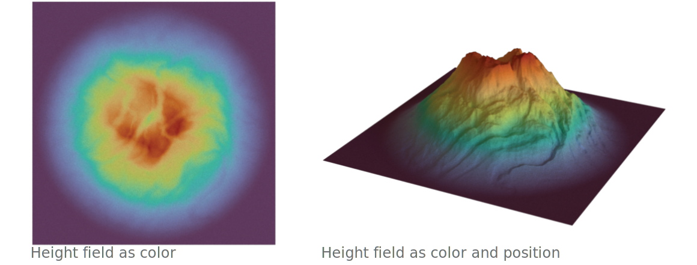
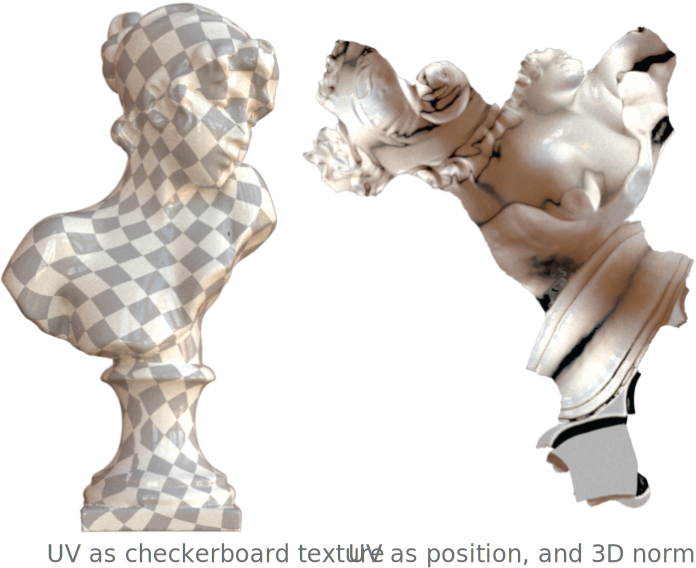

# Channels

A channel represents a specific visual quantity that can be used to encode data. For example, 2D
data visualization often encodes data in position, color, shape and size channels. Similarly in 3D
data visualization, we can encode data in position, normal, size and vector field channels. In
addition, we have the freedom of inventing new visual channels thanks to the diverse material models
that modern rendering engines support. We have a separate guide for [material-based
channels](material.md). In this guide, we will mainly focus on non-material channels.



In the simple landscape example[^1] above, we use color (a visual channel defined in a material) to
encode the height field attribute on the left, and use color + position to encode the same height
field on the right.

[^1]: 3D model generated with Blender's A.N.T.Landscape add-on.

## Position channel

`Position` channel represents the position of 3D marks. By default, the position channel will
use the vertex positions stored in the data frame. It is especially useful when multiple sets of
positions are available (e.g. animation or decimation).

```py
# To specify an attribute as the position channel data:
ch = hkw.channel.Position(data = hkw.attribute(name = "attr_name"))

# A shorthand that is exactly the same as above.
ch = hkw.channel.Position(data = "attr_name")
```

## Normal channel

{: align="right" style="width:400px"}

`Normal` channel represents the normal vector field of a 3D surface. It has significant influence on
how the surface reflect lights. By default, normals will be computed from the 3D data frame. The
`Normal` channel is only relevant for `Surface` mark.

For example, a common technique to visualize UV is to show the 2D UV mesh along with the 3D normal
field. The example[^2] on the right illustrate this technique (right) as well as visualizing UV using
checkerboard texture (left).

[^2]: 3D model source: [Bust of Sappho](https://www.thingiverse.com/thing:14565)

```py
# To specify an attribute as the normal channel data:
ch = hkw.channel.Normal(data = hkw.attribute(name = "attr_name"))

# Shorthand. Same as above
ch = hkw.channel.Normal(data = "attr_name")
```

## Size channel

`Size` channel represents the size of 3D marks. It is only relevant to `Point` and `Curve` marks.
For `Point` mark, size represents the radius of the point mark. For `Curve` mark, size represents
the radius of the curves.

```py
# To sepcify an attribute as the size channel data:
ch = hkw.channel.Size(data = hkw.attribute(name = "attr_name"))

# Shorthand. Same as above
ch = hkw.channel.Size(data = "attr_name")

# To assign constant size field
ch = hkw.channel.Size(data = 0.1)
```

Note that `Size` channel uses the same unit as the `Position` channel.

## Vector field channel

`VectorField` channel defines the data used for a vector field visualization. This channel is only
relevant when the mark is `Curve` as each vector is rendered using the curve geometry.

```py
# To specify an attribute as the vector field channel data.
ch = hkw.channel.VectorField(data = hkw.attribute(name = "attr_name"))

# Shorthand, same as above.
ch = hkw.channel.VectorField(data = "attr_name")
```
