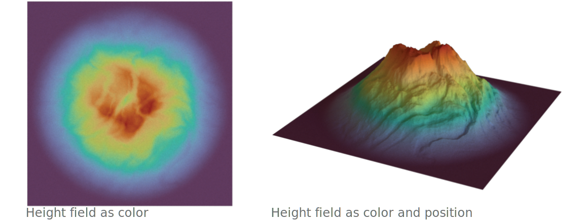
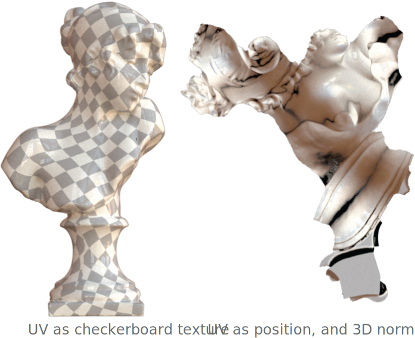
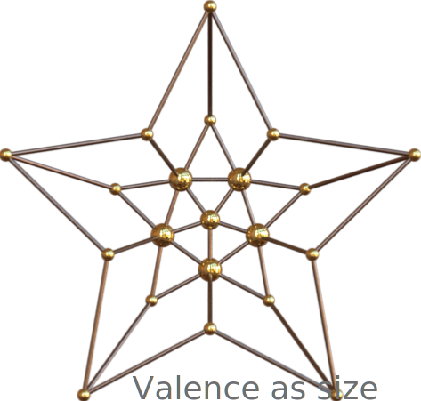
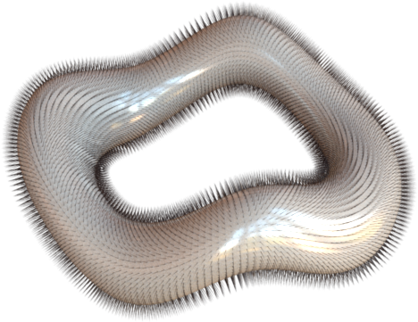
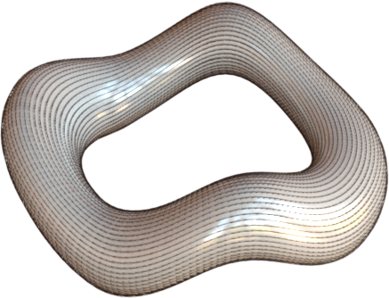
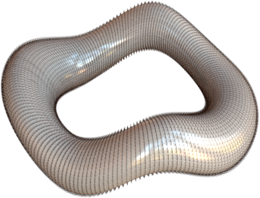

# Channels

A channel represents a specific visual quantity that can be used to encode data. For example, 2D
data visualization often encodes data in position, color, shape and size channels. Similarly in 3D
data visualization, we can encode data in position, normal, size and vector field channels. In
addition, we have the freedom of inventing new visual channels thanks to the diverse material models
that modern rendering engines support. We have a separate guide for [material-based
channels](material.md). In this guide, we will mainly focus on non-material channels.



In the simple landscape example[^1] above, we use color (a visual channel defined in a material) to
encode the height field attribute on the left, and use color + position to encode the same height
field on the right.

[^1]: 3D model generated with Blender's A.N.T.Landscape add-on.

Channels can be specified via `Layer.channel()` function.

```py
# Assume `ch1` is a `Position` channel object,
# and `ch2` is a `Normal` channel object.
l = hkw.layer().channel(position=ch1, normal=ch2)
```

## Position channel

`Position` channel represents the position of 3D marks. By default, the position channel will
use the vertex positions stored in the data frame. It is especially useful when multiple sets of
positions are available (e.g. animation or decimation).

| Channel | Type | Description |
|---------|------|-------------|
| `data` | [AttributeLike][hakowan.scale.attribute.AttributeLike] | The position attribute |

```py
# To specify an attribute as the position channel data:
ch = hkw.channel.Position(data = hkw.attribute(name = "attr_name"))

# A shorthand that is exactly the same as above.
ch = hkw.channel.Position(data = "attr_name")
```

## Normal channel

{: align="right" style="width:400px"}

`Normal` channel represents the normal vector field of a 3D surface. It has significant influence on
how the surface reflect lights. By default, normals will be computed from the 3D data frame. The
`Normal` channel is only relevant for `Surface` mark.

For example, a common technique to visualize UV is to show the 2D UV mesh along with the 3D normal
field. The example[^2] on the right illustrate this technique (right) as well as visualizing UV using
checkerboard texture (left).

[^2]: 3D model source: [Bust of Sappho](https://www.thingiverse.com/thing:14565)

| Channel | Type | Description |
|---------|------|-------------|
| `data` | [AttributeLike][hakowan.scale.attribute.AttributeLike] | The normal attribute |


```py
# To specify an attribute as the normal channel data:
ch = hkw.channel.Normal(data = hkw.attribute(name = "attr_name"))

# Shorthand. Same as above
ch = hkw.channel.Normal(data = "attr_name")
```

## Size channel

{: align="right" style="width:200px"}

`Size` channel represents the size of 3D marks. It is only relevant to `Point` and `Curve` marks.
For `Point` mark, size represents the radius of the point mark. For `Curve` mark, size represents
the radius of the curves.

On the simple star example to the right, the vertex valence of the graph is mapped to the size
channel of the points. The edges are of uniform size.

| Channel | Type | Description |
|---------|------|-------------|
| `data` | [AttributeLike][hakowan.scale.attribute.AttributeLike] | The size attribute |

```py
# To specify an attribute as the size channel data:
ch = hkw.channel.Size(data = hkw.attribute(name = "attr_name"))

# Shorthand. Same as above
ch = hkw.channel.Size(data = "attr_name")

# To assign constant size field
ch = hkw.channel.Size(data = 0.1)
```

Note that `Size` channel uses the same unit as the `Position` channel.

## Vector field channel

{: style="width:220px"}
{: style="width:220px"}
{: style="width:220px"}

`VectorField` channel defines the data used for a vector field visualization. This channel is only
relevant when the mark is `Curve` as each vector is rendered using the curve geometry.

The example[^3] above shows the normal, tangent and bitangent vector field visualization in hair
material.

[^3]: 3D model generated with Blender.

| Channel | Type | Description |
|-----------|------|-------------|
| `data` | [AttributeLike][hakowan.scale.attribute.AttributeLike] | The attribute containing vector field data |


Here is a snippet for creating a `VectorField` channel.

```py
# To specify an attribute as the vector field channel data.
ch = hkw.channel.VectorField(data = hkw.attribute(name = "attr_name"))

# Shorthand, same as above.
ch = hkw.channel.VectorField(data = "attr_name")
```

Note that each vector in the vector field is visualized as a b-spline curve. The vector field's
magnitude determines the curve length. The `Size` channel defines the thickness of the curve.
Vector field channel also takes the following parameters.

| Parameter | Type | Description |
|-----------|------|-------------|
| `refinement_level` | `int` | The refinement level (default: 0) |
| `end_type` | `str` | The end type of each vector (options: `point` (default), `flat`) |
| `style` | [CurveStyle][hakowan.channel.curvestyle.CurveStyle] | The curve style to use (default: None) |

## Covariance channel

`Covariance` channel defines the covariance matrix for point marks, allowing you to visualize
uncertainty or anisotropic data at each point. This channel is only relevant for `Point` mark.
The covariance matrix defines the stretch and rotation applied to each point shape.

| Channel | Type | Description |
|---------|------|-------------|
| `data` | [AttributeLike][hakowan.scale.attribute.AttributeLike] | The attribute containing covariance data |
| `full` | `bool` | If True, the full 3x3 covariance matrix is stored. If False (default), the "square root" matrix M is stored where Σ = M @ M^T |

```py
# To specify an attribute as the covariance channel data:
ch = hkw.channel.Covariance(data="covariance_attr", full=True)

# Shorthand, same as above
ch = hkw.channel.Covariance(data="covariance_attr")
```

## Shape channel

`Shape` channel defines the base shape used to visualize points. This channel is only relevant for
`Point` mark and allows you to use different shapes (sphere, cube, disk) for point visualization.

| Channel | Type | Description |
|---------|------|-------------|
| `base_shape` | `str` | The base shape: "sphere" (default), "cube", or "disk" |
| `orientation` | [AttributeLike][hakowan.scale.attribute.AttributeLike] or `None` | The attribute defining the orientation of each shape (default: None) |

```py
# Use cubes for point visualization
ch = hkw.channel.Shape(base_shape="cube")

# Use oriented disks with normal attribute
ch = hkw.channel.Shape(base_shape="disk", orientation="normal_attr")
```

## Bump map channel

`BumpMap` channel adds surface detail by perturbing normals based on a texture without modifying
the actual geometry. This is useful for adding visual complexity to surfaces.

| Channel | Type | Description |
|---------|------|-------------|
| `texture` | [TextureLike][hakowan.texture.TextureLike] | The texture defining the bump map |
| `scale` | `float` | The scale factor for the bump effect (default: 1.0) |

```py
# Add bump map from image
ch = hkw.channel.BumpMap(
    texture=hkw.texture.Image("bump_map.png"),
    scale=0.5
)
```

You can also specify bump maps directly in material definitions. See the [Material guide](material.md#bump-mapped-material)
for examples.

## Normal map channel

`NormalMap` channel replaces surface normals with normals from a texture, providing more control
over lighting than bump maps. Normal maps are commonly used in game engines and 3D rendering.

| Channel | Type | Description |
|---------|------|-------------|
| `texture` | [TextureLike][hakowan.texture.TextureLike] | The texture defining the normal map |

```py
# Add normal map from image
ch = hkw.channel.NormalMap(
    texture=hkw.texture.Image("normal_map.png", raw=True)
)
```

Note that normal map textures should use `raw=True` to ensure linear color interpretation.

