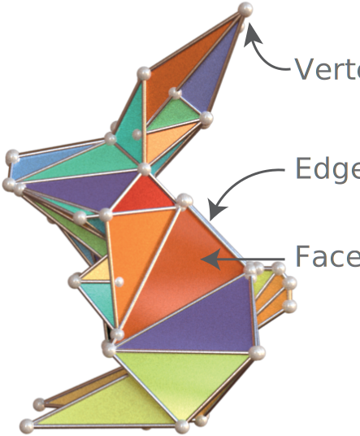

# Data

In 3D data visualization, we distinguish two types of 3D data:
3D geometry and data associated with 3D geometry.

* __3D geometry as data__: In this category, we are mainly interested in visualizing the shape/location of
  the 3D geometry. For example, the shape of a deformed mesh or the location of points in a point
  cloud.
* __Data associated with 3D geometry__: In this category, the data is a spatially varying field,
  and we would like to visualize its value at different locations. For example, the Gaussian
  curvature field on a curved surface, or the geodesic distance on a surface with respect to a
  source surface point.

{: align="right" style="width:200px"}

3D geometry are often represented as a mesh for visualization purposes. A mesh, such as the bunny
model on the right[^1], consists of a set of vertices
edges and facets.
Data associated with 3D geometry are represented as an _attribute_ of a mesh. Each attribute is
defined for a specific element type (vertex, edge or facet).

[^1]: 3D model source: [origamix rabbit](https://www.thingiverse.com/thing:600429)

In Hakowan, we leverage Lagrange's
[SurfaceMesh](https://opensource.adobe.com/lagrange-docs/user/core/mesh/) data structure to
represent both 3D geometry and store
data associated with 3D geometry
as [mesh attributes](https://opensource.adobe.com/lagrange-docs/user/core/attributes/).
In a sense, the elements of a mesh defines the "rows" of a 3D data frame, and the attributes
of a mesh defines the "columns" of a 3D data frame.
In addition, Hakowan can also extract geometry and data associated
with geometry from a number of common 3D file formats such as OBJ, PLY, GLTF and MSH.

Here is a quick example demonstrating the various ways of specifying data in Hakowan:
```py
# As argument to hkw.layer() method.
l0 = hkw.layer("shape.obj")

# As argument to .data overwrite function.
l1 = hkw.layer().data("shape.obj")

# Lagrange SurfaceMesh object can also be used instead of filename.
mesh = lagrange.io.load_mesh("shape.obj")
l2 = hkw.layer(mesh)
l3 = hkw.layer().data(mesh)
```


<!--
In 2D data visualization, data is often represented as a table or data frame (e.g. Excel sheet or
CSV file) with each row representing a single data point or observational unit and each column
representing an attribute or observed value associated with each of the data points.

For 3D data, we extends this notion of data frame. A "row" in a 3D data frame represents a 3D
spatial element (e.g. a point, a line segment or a polygon) on which we can sample 3D data values.
A "column" in a 3D data frame represents a spatically varying data field (e.g. scalar or vector
field), for which we know its value at a set of 3D spatial elements.
-->

