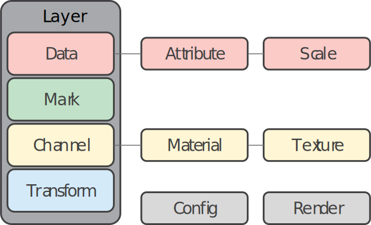

## Grammar Overview

The grammar of a language provides a set of structural rules to combine words
together to form semantically meaningful statements. Similarly, from the data
visualization community, the seminal work of [The Grammar of
Graphics](https://link.springer.com/book/10.1007/0-387-28695-0) from Leland
Wilkinson proposed a structured way to systematically decompose a graphic (i.e.
chart) into a set of visual and mathematical components. Much like the recipe
of a dish, each component is independent, and together they provide a complete
specification of a chart. The grammar of graphics is a highly flexible
way of describing the desired chart while abstracting away much of the tedious
details related to chart drawing.

{: align="right" style="width:400px" }

Hakowan is a 3D data visualization grammar based on the concept of the grammar of graphics. It
identifies 4 key components in 3D data visualization: [_data_](data.md), [_mark_](mark.md),
[_channels_](channel.md) and [_transform_](transform.md).

Data consists of a set of mesh [_attributes_](attribute.md) defined over mesh elements. Attributes
are the "columns" in our data, and they can be mapped to different visual channels. Each attribute
can optionally be associated with a [_scale_](scale.md) transformation. A mark defines the basic
types of visualization elements (e.g. point, curve, surface). A channel represent some form of
visual property used to encode data. Hakowan supports various [_materials_](material.md), where each
material may expose multiple visual channels. The mapping from an attribute to a material channel is
defined by a [texture](texture.md). A transform represents a set of global transformations (e.g.
adding/removing geometry and/or attributes) applied to the data before visualization.

A complete specification of data, mark, channel and transform components forms a [_layer_](layer.md) in the visualization.
Each component of a layer can be overwrite, and multiple layers can be combined together to generate
composite visualization.


## API Overview

For the rest of this document, we will assume the `hakowan` package has been imported as the alias `hkw`.

```py
import hakowan as hkw
```

### Create a layer

Layer is the most fundamental object within Hakowan as it contains the complete
specification of all 4 key components. The following snippet shows how to
create an empty layer.

```py
base = hkw.layer()
```

In an empty layer, all 4 components are `None`. In order for a layer to be render-able, data should
specified. The other 3 components will fall back to default values if not specified.


### Specify data

Given a `base` layer, we use the `.data` method to specify data.

```py
# Specify data from file
l = base.data("filename.obj")

# Specify data from lagrange.SurfaceMesh object
l = base.data(mesh)
```

### Specify mark

Mark can be specified with `.mark` method of layer object.

```py
l = base.mark(hkw.mark.Point)
```

### Specify channel

Similarly, channels can be specified with `.channel` method.

```py
l = base.channel(
    position=hkw.channel.Position(data="my_position"),
    normal=hkw.channel.Normal(data="my_normal")
)
```

In the above example, we specify two channels in the same `.channel` call.
In each specification, we created the corresponding `Position` or `Normal` channel objects.
The `data` parameter here specifies the associated attribute to use for channel encoding.

Material can also be specified with `.channel` method.

```py
l = base.channel(
    material=hkw.material.Diffuse(reflectance="grey")
)
```

Here, we simply assign a uniform color to the reflectance channel of the `Diffuse` material.
To use mesh attribute to encode material channel, we need to use a texture.

```py
l = base.channel(
    material=hkw.material.Diffuse(
        reflectance=hkw.texture.ScalarField(
            data="attr_name"
        )
    )
)
```

### Specify transform

We use the `.transform` method of a layer object to specify transform.

```py
l = base.transform(
    hkw.transform.Filter(
        data="attr_name",
        condition=lambda p:p[0] > 0
    )
)
```

### Layer composition

Let `l0` and `l1` be two layers, we can use addition to combine them together.

```py
combined_layer = l0 + l1
```
