# Material

In 3D data visualization, material is the new color! By assigning a material to the 3D geometry, we
can not only achieve more photorealistic visual quality but also encode data in more channels than
just RGB. Hakowan leverages [Mitsuba's material
support](https://mitsuba.readthedocs.io/en/latest/src/generated/plugins_bsdfs.html) to provide a
number of material-based visual channels.

All materials support the following parameters:

| Parameter | Type | Description |
|-----------|------|-------------|
| `two_sided` | `bool` | Wheter the material is two-sided. (default: false) |

A material can be specified via the `Layer.channel()` method.
```py
# Assume `m` is a `Material` object
l = hkw.layer().channel(material=m)
```

Hakowan also provides the shortcut method `Layer.material()` to specify material directly.
```py
l = hkw.layer().material("Diffuse", "orange", two_sided=True)
l = hkw.layer().material("Principled", "ivory", roughness=0.2, metallic=0.8)
```


## Diffuse material

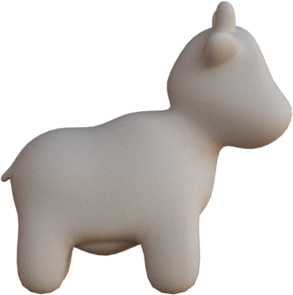{: style="width:170px"}
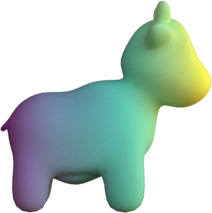{: style="width:170px"}
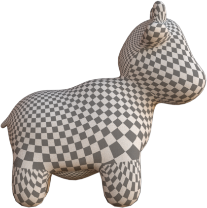{: style="width:170px"}
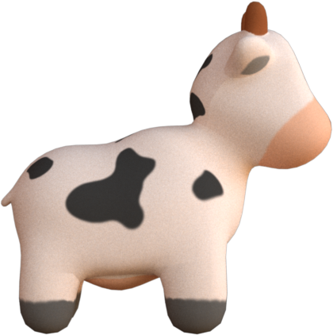{: style="width:170px"}

`Diffuse` material provides a matte shading to the shape. It is good for visualizing scalar field
data without any interference from specular highlight.

| Channel | Type | Description |
|---------|------|-------------|
| `reflectance` | [TextureLike][hakowan.texture.TextureLike] | Base color of the material (default: 0.5) |

Here is a simple example of creating a `Diffuse` material.

```py
m = hkw.material.Diffuse("ivory")
```

Here, we assign a uniform color, "blue", to the `reflectance` channel. To encode actual data, we
need to assign a [texture](texture.md) to the `reflectance` channel.

```py
m = hkw.material.Diffuse(hkw.texture.ScalarField(data = "attr_name"))
```

Check the [Mitsuba
doc](https://mitsuba.readthedocs.io/en/latest/src/generated/plugins_bsdfs.html#smooth-diffuse-material-diffuse)
for more details.

## Conductor material

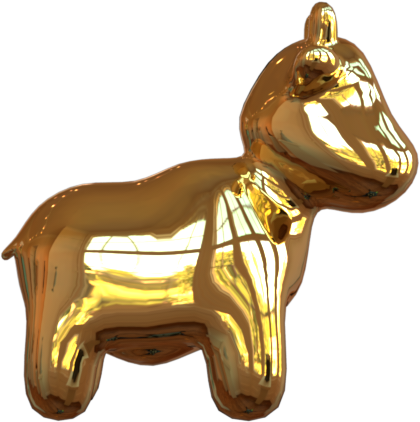{: style="width:170px"}
{: style="width:170px"}
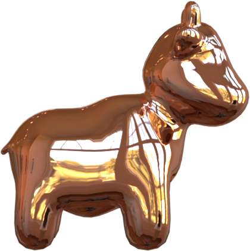{: style="width:170px"}
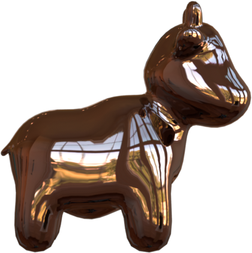{: style="width:170px"}

`Conductor` material gives the geometry a metallic look and feel. It takes a `material` parameter as
input, but it cannot be used to encode any data.

| Parameter | Type | Description |
|-----------|------|-------------|
| `material` | `str` | Material type (see [supported material types](https://mitsuba.readthedocs.io/en/latest/src/generated/plugins_bsdfs.html#conductor-ior-list)) |

Here is a snippet to create a `Conductor` material of type `Al`.

```py
m = hkw.material.Conductor(material="Al")
```

Check the [Mitsuba
doc](https://mitsuba.readthedocs.io/en/latest/src/generated/plugins_bsdfs.html#smooth-conductor-conductor)
for more details.

## Rough conductor material

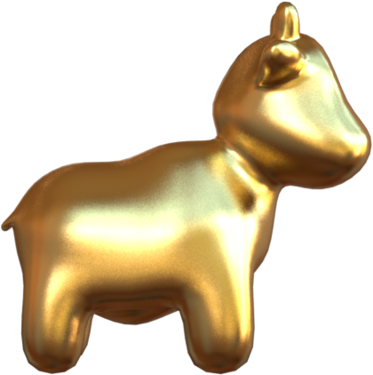{: style="width:170px"}
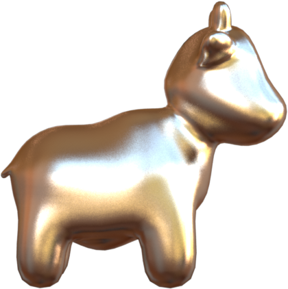{: style="width:170px"}
{: style="width:170px"}
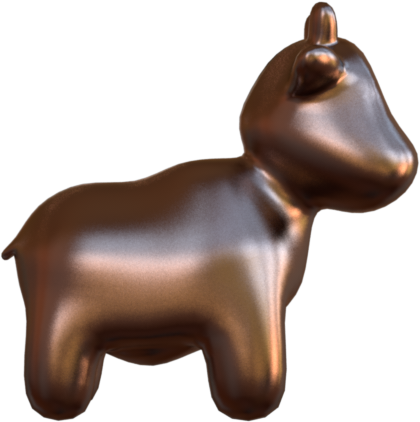{: style="width:170px"}

`RoughConductor` material gives the geometry a matte metallic look and feel. It takes a `material`
parameter just like `Conductor`. In addition, it also takes a `distribution` parameter and a `alpha`
channel.

| Channel | Type | Description |
|---------|------|-------------|
| `alpha` | [Texture] [hakowan.texture.Texture] or `float` | Roughness value from 0 (smooth) to 1 (rough) (default: 0.1) |

| Parameter | Type | Description |
|-----------|------|-------------|
| `material` | `str` | Material type (see [supported material types](https://mitsuba.readthedocs.io/en/latest/src/generated/plugins_bsdfs.html#conductor-ior-list)) |
| `distribution` | `str` | Microfacet normal distribution: `ggx` or `beckmann` (default) |

Here is a simple example of using `RoughConductor`.

```py
m = hkw.material.RoughConductor(material = "Cu")
```

Here is a more complex example where we map an attribute to the alpha channel:

```py
m = hkw.material.RoughConductor(
    material="Cu", alpha=hkw.texture.ScalarField(data="attr_name")
)
```

Note that `alpha`=0.1 is relatively rough, and `alpha` from 0.3 to 0.7 is very rough. Beyond 0.7,
the result does not look very realistic.

Check out the [Mitsuba
doc](https://mitsuba.readthedocs.io/en/latest/src/generated/plugins_bsdfs.html#rough-conductor-material-roughconductor)
for more details.

## Plastic material

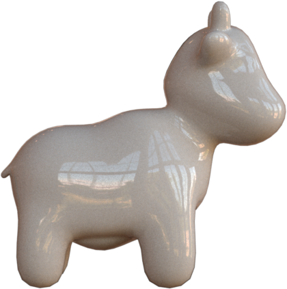{: style="width:200px"}
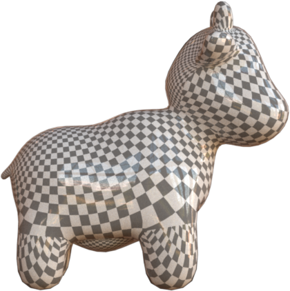{: style="width:200px"}
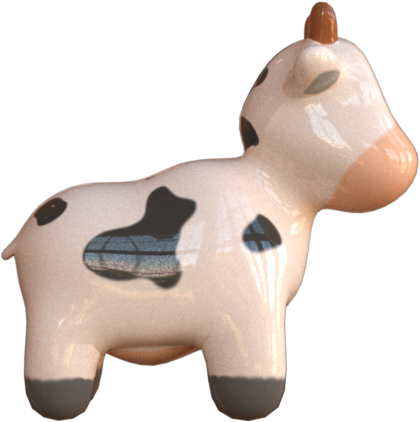{: style="width:200px"}

`Plastic` material provides a smooth plastic look and feel.
Hakowan exposes two visual channels in this material:

| Channel | Type | Description |
|---------|------|-------------|
| `diffuse_reflectance` | [TextureLike][hakowan.texture.TextureLike] | Base color of the material (default: 0.5) |
| `specular_reflectance` | [Texture][hakowan.texture.Texture] or `float` | Specular reflectance component (default: 1.0) |

Here is a snippet to create a `Plastic` material:

```py
m = hkw.material.Plastic(
    diffuse_reflecctance=hkw.texture.ScalarField(data="attr_name"),
    specular_reflectance=hkw.texture.ScalarField(data="attr2_name")
)
```

Check out the [Mitsuba
doc](
https://mitsuba.readthedocs.io/en/latest/src/generated/plugins_bsdfs.html#smooth-plastic-material-plastic
)
for more details.

## Rough plastic material

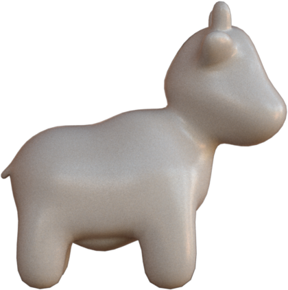{: style="width:200px"}
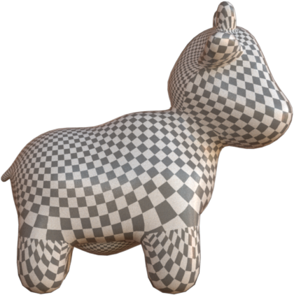{: style="width:200px"}
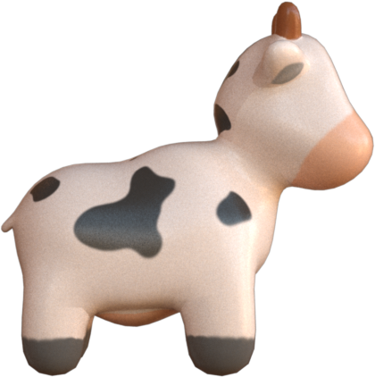{: style="width:200px"}

Similar to `RoughConductor`, the
`distribution` parameter controls the microfacet normal distribution, and its valid values are `ggx`
and `beckmann` (default). The `alpha` parameter control the roughness of the material.

| Channel | Type | Description |
|---------|------|-------------|
| `diffuse_reflectance` | [TextureLike][hakowan.texture.TextureLike] | Base color of the material (default: 0.5) |
| `specular_reflectance` | [Texture][hakowan.texture.Texture] or `float` | Specular reflectance component (default: 1.0) |

Addition to the above visual channels, this material also expose the following parameters.

| Parameter | Type | Description |
|---------|------|-------------|
| `distribution` | `str` | Microfacet normal distribution: `ggx` or `beckmann` (default) |
| `alpha` | `float` | Roughness value from 0 (smooth) to 1 (rough) (default: 0.1) |

Here is a snippet to create a `RoughPlastic` material:

```py
m = hkw.material.RoughPlastic(
    diffuse_reflecctance=hkw.texture.ScalarField(data="attr_name"),
    specular_reflectance=hkw.texture.ScalarField(data="attr2_name"),
    alpha=0.1
)
```

Note that `alpha`=0.1 is relatively rough, and `alpha` from 0.3 to 0.7 is very rough. Beyond 0.7,
the result does not look very realistic.

Check out the [Mitsuba
doc](
https://mitsuba.readthedocs.io/en/latest/src/generated/plugins_bsdfs.html#rough-plastic-material-roughplastic
)
for more details.

## Principled material

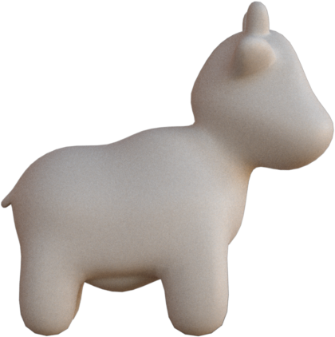{: style="width:170px"}
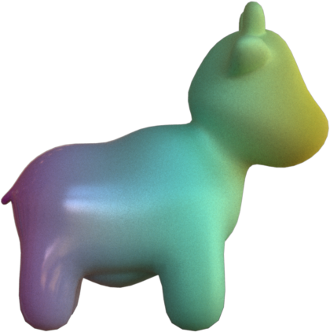{: style="width:170px"}
{: style="width:170px"}
{: style="width:170px"}

`Principled` material is the most versatile material. It is based on paper "[Physically Based
Shading](https://www.disneyanimation.com/publications/physically-based-shading-at-disney/)" and its
extension. It can be used to approximate almost all other materials.

| Channel | Type | Description |
|---------|------|-------------|
| `color` | [TextureLike][hakowan.texture.TextureLike] | Base color of the material (default: 0.5) |
| `roughness` | [Texture][hakowan.texture.Texture] or `float` | Roughness value from 0 (smooth) to 1 (rough) (default: 0.5) |
| `metallic` | [Texture][hakowan.texture.Texture] or `float` | Metallic value from 0 (not metallic) to 1 (very metallic) (default: 0.0) |

As a rule of thumb, `roughness` and `metallic` are effective at encoding binary categorical data,
but not very effective for quantitative data.

Here is a snippet to create a `Principled` material:

```py
m = hkw.material.Principled(
    color=hkw.texture.ScalarField(data="attr_name"),
    roughness=hkw.texture.ScalarField(data="attr_name2"),
    metallic=hkw.texture.ScalarField(data="attr_name3"),
)
```

Here is another example where the color, roughness and metallic channels are uniform across the
entire shape.

```py
m = hkw.material.Principled(color="#252525", roughness=0.2, metallic=0.8)
```

Check out the [Mitsuba
doc](
https://mitsuba.readthedocs.io/en/latest/src/generated/plugins_bsdfs.html#the-principled-bsdf-principled
)
for more details.

## Dielectric material

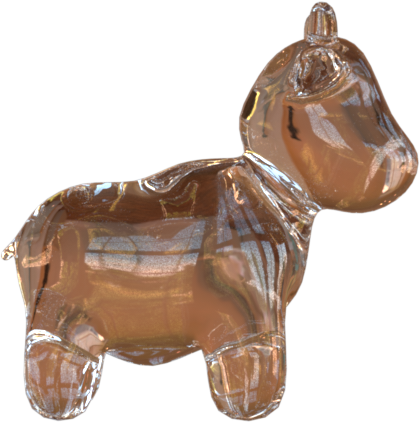{: style="width:200px"}
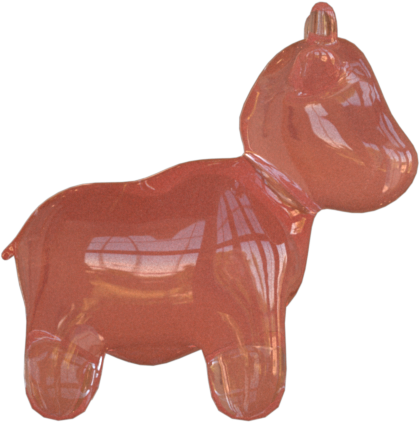{: style="width:200px"}
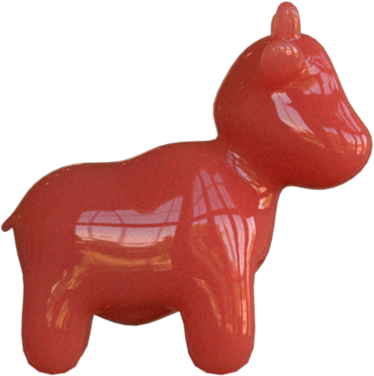{: style="width:200px"}

`Dielectric` material provides a smooth glossy look and feel. This material exposes no visual
channels and have the following parameters.


| Parameter | Type | Description |
|---------|------|-------------|
| `int_ior` | `str` or `float` | Interior index of refraction (default: `bk7`, see [supported ior list](https://mitsuba.readthedocs.io/en/stable/src/generated/plugins_bsdfs.html#ior-table-list)) |
| `ext_ior` | `str` or `float` | Exterior index of refraction (default: `air`, see [supported ior list](https://mitsuba.readthedocs.io/en/stable/src/generated/plugins_bsdfs.html#ior-table-list)) |
| `medium` | `Medium` | Medium of the enclosed material (default: `None`) |

Note that by default, `Dielectric` material does not expose a color channel. Color is specified
indirectly through the `medium` parameter. Medium describes the material/medium enclosed by the
shape. It can provide fancy effects such as sub-surface scattering. However, `medium` setting
requires the `volpath` integrator.

Here is a snippet for creating a `Dielectric` material.

```py
m = hkw.material.Dieletric(int_ior="water")
```

Check out the [Mitsuba
doc](
https://mitsuba.readthedocs.io/en/stable/src/generated/plugins_bsdfs.html#smooth-dielectric-material-dielectric
)
for more details.

## Rough dielectric material

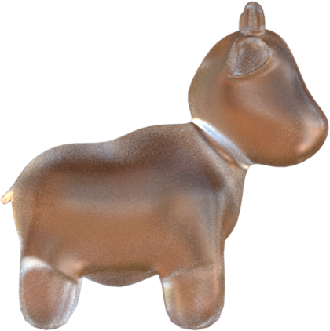{: style="width:200px"}
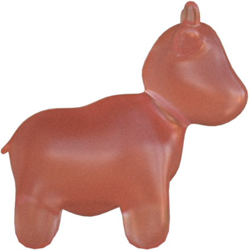{: style="width:200px"}
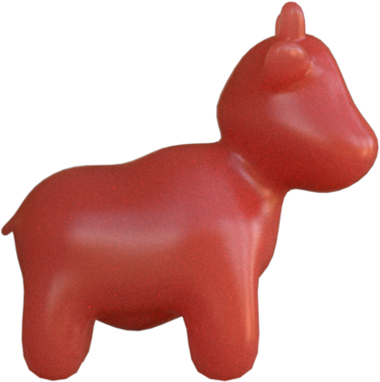{: style="width:200px"}

`RoughDielectric` material provides a matte glass look and feel. Similar to the `RoughConductor`
material, This material exposes an `alpha` visual channel.

| Channel | Type | Description |
|---------|------|-------------|
| `alpha` | [Texture] [hakowan.texture.Texture] or `float` | Roughness value from 0 (smooth) to 1 (rough) (default: 0.1) |

Although `alpha` channel is available to encode data, based on our experiments, its effect is
somewhat limited.
Here are the parameters of this material.

| Parameter | Type | Description |
|-----------|------|-------------|
| `int_ior` | `str` or `float` | Interior index of refraction (default: `bk7`, see [supported ior list](https://mitsuba.readthedocs.io/en/stable/src/generated/plugins_bsdfs.html#ior-table-list)) |
| `ext_ior` | `str` or `float` | Exterior index of refraction (default: `air`, see [supported ior list](https://mitsuba.readthedocs.io/en/stable/src/generated/plugins_bsdfs.html#ior-table-list)) |
| `medium` | `Medium` | Medium of the enclosed material (default: `None`) |
| `distribution` | `str` | Microfacet normal distribution: `ggx` or `beckmann` (default) |

Here is a snippet for creating a `RoughDielectric` material.

```py
m = hkw.material.RoughDieletric(int_ior="water")
```

## Thin dielectric material

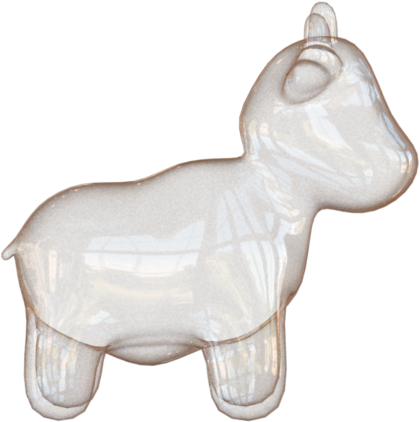{: style="width:200px"}

`ThinDielectric` material provides a thin glossy shell look and feel for a given shape. It does not
expose any visual channels.

| Parameter | Type | Description |
|-----------|------|-------------|
| `int_ior` | `str` or `float` | Interior index of refraction (default: `bk7`, see [supported ior list](https://mitsuba.readthedocs.io/en/stable/src/generated/plugins_bsdfs.html#ior-table-list)) |
| `ext_ior` | `str` or `float` | Exterior index of refraction (default: `air`, see [supported ior list](https://mitsuba.readthedocs.io/en/stable/src/generated/plugins_bsdfs.html#ior-table-list)) |
| `medium` | `Medium` | Medium of the enclosed material (default: `None`) |

Here is a snippet for creating a `ThinDielectric` material.

```py
m = hkw.material.ThinDielectric(int_ior="water")
```

## Hair material

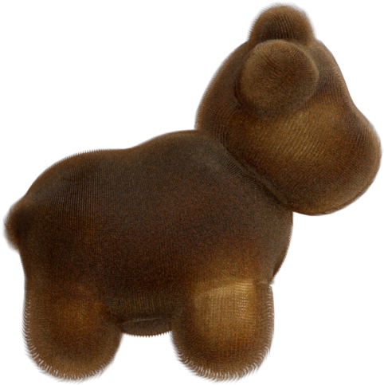{: style="width:200px"}

`Hair` material from Mitsuba provides a hair-like look and feel. This material is designed to
specifically work with curve mark. It does not provide any channels for encoding data.

| Parameter | Type | Description |
|-----------|------|-------------|
| eumelanin | `float` | The amount of dark/black/brown pigments (default: 1.3) |
| pheomelanin | `float` | The amount of red/yellow pigments (default: 0.2) |

Here is a snippet for creating a `Hair` material.

```py
m = hkw.material.Hair(eumelanin=0.3, pheomelanin=0.1)
```

Check out the [Mitsuba
doc](
https://mitsuba.readthedocs.io/en/latest/src/generated/plugins_bsdfs.html#hair-material-hair
)
for more details.

## Two-sided material

Sometimes, the mesh we have may not be correctly oriented. Inverted facets will appear to be black.
To avoid such artifact, all material classes support an optional `two_sided` parameter to enabled
two-sided normals.

```py
m = hkw.material.Diffuse("salmon", two_sided=True)
```

## Bump mapped material

A bump map can be applied to any material by setting the `bump_map` texture and `bump_scale`
parameter. The former parameters defines the raw bump map texture where the latter defines the
multiplicative factor to scale the bump magnitude.

```py
m = hkw.material.Diffuse(
    "salmon",
    bump_map=hkw.texture.Image("bump_map.png"),
    bump_scale=0.5,
)
```
See the [Moon example](../examples/moon.md) for an application of bump map.
